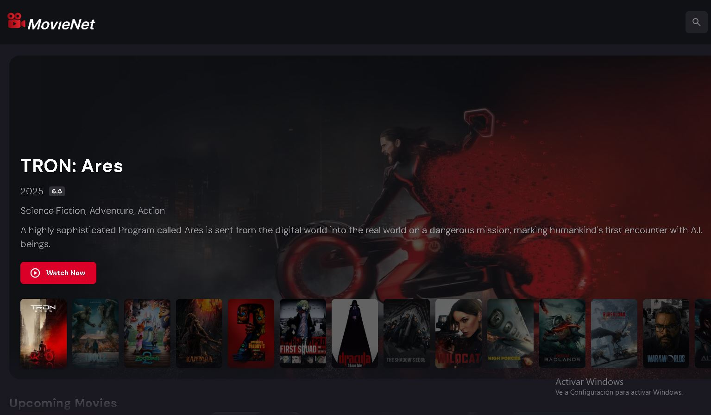

<p align="center">
  
</p>
<h1 align="center">Project Angular .Net and SQL</h1>

<p align="center">With this challenge we by means of this application we build a client to watch movies.</p>

<p align="center">
  <a title="Twitter: Jose_leonardo" href="https://www.linkedin.com/in/jose-leonardo-poveda/">
    
  </a>  
  <a title="Github: Sponsors" href="https://github.com/shiwirockztar">
    
  </a>
  <br />
  <br />
# Angular Movie Website
  
🌐 **[Ver aplicación en vivo](https://shiwirockztar.github.io/Angular-Movie-Website/)** 

---

## Capturas de pantalla

### Home


### Dashboard


## Descripción

Aplicación cliente para buscar películas, ver detalles y guardar películas en el perfil del usuario. Está diseñada como frontend en Angular; si necesitas una API/Backend, en este repositorio solo está incluida la parte frontend (la README original mencionaba .NET y MySQL, pero no se encuentran aquí los archivos del backend).

## Estructura de carpetas (resumen actual)

La estructura principal del proyecto es la siguiente (solo se muestran las carpetas más relevantes):

```
Readme.md
Angular/
  angular.json
  package.json
  tsconfig.json
  src/
    index.html
    main.ts
    styles.css
    app/
      app.module.ts
      app.component.ts
      components/
        banner/
        gallery/
        header/
        home-sidebar/
        movie-list/
        navbar/
        recommended-list/
        sidebar/
      models/
      pages/
      services/
    assets/
assets/

```

Nota: la carpeta `Angular/` contiene la aplicación frontend completa. Si tienes un backend, colócalo en una carpeta raíz separada (por ejemplo `Backend/`).

## Requisitos previos

- Node.js (recomendado >= 18)
- npm (v9+)
- Angular CLI (opcional globalmente)

Si no tienes Angular CLI instalado globalmente puedes instalarlo (opcional):

```bash
npm install -g @angular/cli
```

> No es estrictamente necesario instalar Angular CLI globalmente si prefieres usar los scripts locales de `package.json` dentro de `Angular/`.

## Instrucciones para ejecutar el proyecto (frontend)

1. Abrir una terminal y situarse en la carpeta del frontend:

```bash
cd Angular
```

2. Instalar dependencias:

```bash
npm install
```

3. Ejecutar la aplicación en modo desarrollo:

```bash
npm start
# o usando ng directamente si tienes Angular CLI global:
ng serve --open
```

El comando `npm start` suele ejecutar `ng serve`. Esto levantará el servidor de desarrollo y abrirá la app en `http://localhost:4200/` (o mostrando la URL en la consola).

## Comandos útiles

- Instalar dependencias: `npm install` (dentro de `Angular/`)
- Ejecutar app en desarrollo: `npm start` o `ng serve --open`
- Construir para producción: `ng build --configuration production` o `npm run build` si está definido
- Ejecutar tests (si están definidos): `npm test`
- Lint (si está configurado): `npm run lint`

## Si necesitas actualizar dependencias

Puedes usar `npm-check-updates` para revisar y actualizar versiones de dependencias globalmente:

```bash
npm i -g npm-check-updates
ncu -u
npm install
```

## Notas y recomendaciones

- Si el proyecto depende de un backend (API REST), asegúrate de tenerlo corriendo y de actualizar las URLs en `src/app/services` o en el archivo de configuración de ambiente (`environment.ts`).
- Usa `ng serve --host 0.0.0.0` si necesitas exponer la app en la red local (útil en contenedores o máquinas remotas).
- Revisa `Angular/package.json` para ver scripts personalizados.

## Despliegue en GitHub Pages

Para desplegar la aplicación Angular en GitHub Pages, sigue estos pasos:

### 1. Construir la aplicación para producción

```bash
cd Angular
npm install -g @angular/cli
ng build --configuration production
# o también puedes usar:
ng build -c production
```

### 2. Instalar angular-cli-ghpages

```bash
ng add angular-cli-ghpages
```

### 3. Desplegar en GitHub Pages

```bash
ng deploy --dir=dist/movie-net --repo=https://github.com/shiwirockztar/Angular-Movie-Website.git --name="shiwirockztar" --base-href=/Angular-Movie-Website/
```

**Parámetros importantes:**
- `--dir=dist/movie-net`: Especifica la carpeta de salida del build (carpeta real donde se genera la aplicación compilada)
- `--repo`: URL del repositorio GitHub
- `--name`: Tu nombre de usuario de GitHub
- `--base-href`: Ruta base del repositorio en GitHub Pages (`/nombre_del_repositorio/`)

La aplicación estará disponible en: `https://shiwirockztar.github.io/Angular-Movie-Website/`

> **Nota:** Asegúrate de que GitHub Pages esté habilitado en tu repositorio (Settings → Pages → Source: gh-pages branch).

### 4. Actualizar cambios en el deploy

Para subir cambios a la rama de despliegue (gh-pages), solo necesitas:

1. Agregar los cambios a la rama maestra (main):

```bash
git add .
git commit -m "Descripción de los cambios"
git push origin main
```

2. Volver a ejecutar el comando de deploy:

```bash
ng deploy --dir=dist/movie-net --repo=https://github.com/shiwirockztar/Angular-Movie-Website.git --name="shiwirockztar" --base-href=/Angular-Movie-Website/
```

Esto reconstruirá la aplicación y desplegará los cambios automáticamente a GitHub Pages.

Para más información, consulta la [documentación oficial de Angular sobre despliegue](https://v17.angular.io/guide/deployment).

## Contacto

Repositorio: https://github.com/shiwirockztar/Angular-Movie-Website
